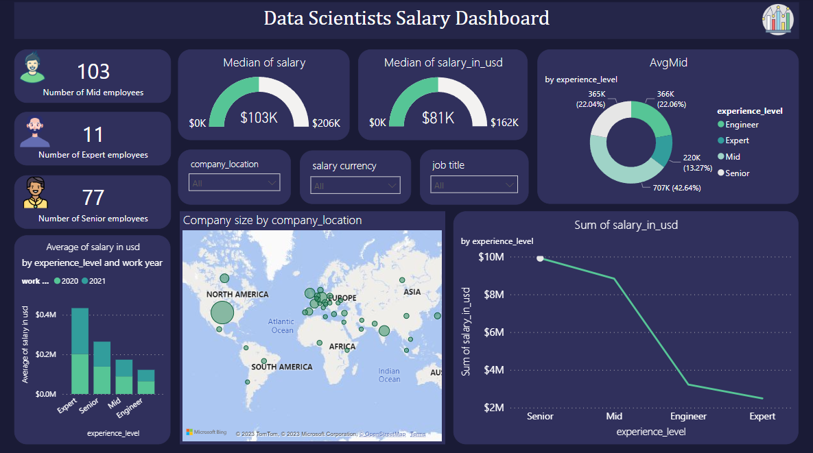
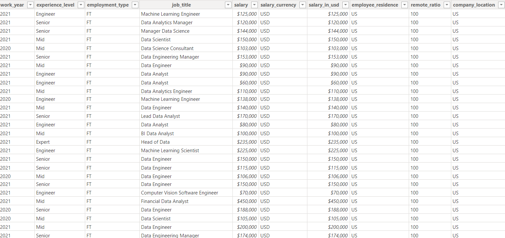
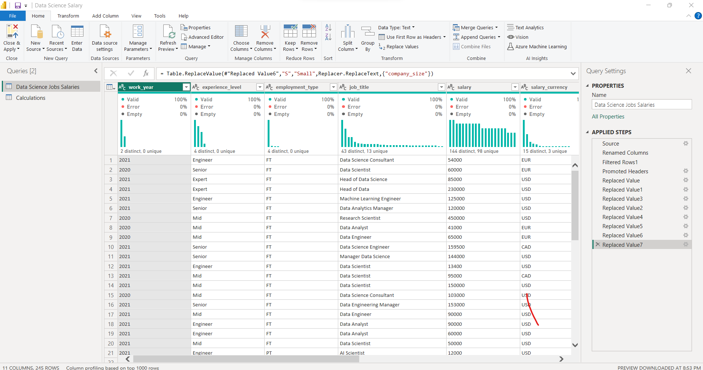

# Table of Contents
1.**Introduction**
1.**Overview Dashboard**
3.**Dataset**
4.**Power Query**
5.**Usage**

# Intoduction
The project aims to analyze the 'Data Scientists Salaries' dataset to derive insights and facilitate data-driven decision-making for anyone interested in data analysis and dashboards.

# Overview Dashboard

**Process of the project**

 the process of analyzing data scientist salaries using Power BI and Power Query involves collecting a comprehensive dataset, cleaning and transforming the data with Power Query, creating insightful visualizations in Power BI, and building an interactive dashboard for collaborative decision-making. Advanced analytics features can be employed for deeper insights, and regular updates ensure the analysis remains current. Documentation and iterative analysis enhance the robustness of the project, providing valuable insights into data scientist salary trends for stakeholders.

# Dataset

The dataset, named Data 'Science Jobs Salaries', contains the following columns:

work_year

experience_level

employment_type

job_title

salary

salary_currency

salary_in_usd

employee_residence

remote_ratio

company_location

♦️... (and other attributes related to data scientist salaries)

# Power Query
**Data Processing and cleaning Power Query**
1. Load the dataset into Power BI
2.Utilize Power Query to clean and preprocess the data:
  - Handle missing values.
  - Remove duplicates.
  - Convert data types.
  - Address outliers or anomalies.
**Power Query**

# Usage
you can access the Power BI dashboard and the dataset by download the file I mentioned above
